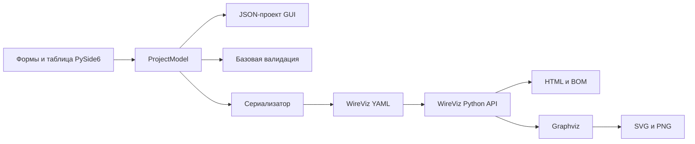

# WireWizardGUI

WireWizardGUI — настольный прототип редактора кабельных сборок и жгутов поверх
[WireViz](https://github.com/wireviz/WireViz). Приложение позволяет описать
разъёмы, кабели, наконечники и связи между ними через обычные формы и таблицу,
после чего получить YAML в синтаксисе WireViz, предварительный SVG и выходные
файлы WireViz.

Проект рассчитан на тех, кому удобнее собирать описание жгута в GUI, чем писать
YAML вручную: разработчиков электроники, инженеров, сборщиков прототипов и
авторов производственной документации.

> [!IMPORTANT]
> Это не графический CAD и не полноценный редактор всего формата WireViz.
> WireWizardGUI редактирует поддерживаемую модель проекта, а схему рисует
> встроенный Python-модуль WireViz с помощью Graphviz. Неизвестные поля YAML
> сохраняются семантически, но комментарии, anchors и исходное форматирование — нет.

## Возможности

- создание и редактирование проекта жгута;
- разъёмы с типом, подтипом, числом и обозначениями контактов, метками, цветом и
  примечаниями;
- кабели и жгуты с сечением, длиной, числом жил, цветами, метками, экраном и
  категорией `bundle`;
- обжимные и двойные наконечники (`ferrules`);
- поля BOM для компонентов: внутренний P/N, производитель/MPN,
  поставщик/SPN и исключение из спецификации;
- табличный редактор маршрутов соединений с динамическим числом шагов и
  контекстной фильтрацией следующего компонента;
- параллельные группы компонентов, контактов, жил и стрелок, именованные контакты и
  подключение экрана;
- мастер массовой разводки в режимах последовательного шлейфа и звезды;
- библиотека типовых разъёмов, кабелей и наконечников;
- отмена и повтор до 100 изменений проекта;
- базовая проверка проекта до передачи в WireViz;
- доступный только для чтения предпросмотр итогового YAML;
- SVG-предпросмотр через локальные WireViz и Graphviz;
- автоматическое обновление YAML и рисунка после завершения ввода;
- примеры формата и подробные всплывающие подсказки для инженерных полей;
- сохранение рабочего проекта GUI в JSON;
- открытие JSON-проекта, импорт и экспорт WireViz YAML;
- меню недавних JSON-проектов, восстановление раскладки окна и аварийной копии;
- запуск WireViz из приложения для создания схемы и спецификации;
- встроенная панель результатов для BOM, PDF, CSV, TSV, SVG, PNG и HTML.

При старте открывается демонстрационный жгут. Кнопка `New` создаёт пустой проект.

## Как это работает



1. Интерфейс записывает данные в Python-модель `ProjectModel`.
2. Валидатор ищет распространённые ошибки в компонентах и маршрутах.
3. Сериализатор преобразует модель в структуру WireViz и YAML.
4. JSON хранит полный рабочий проект WireWizardGUI, а YAML служит для обмена с
   WireViz.
5. Для предпросмотра приложение ставит вызов встроенного Python API WireViz в
   фоновую очередь и показывает созданный SVG через Qt.
6. `Run WireViz` в той же фоновой очереди сохраняет YAML в выбранный каталог и
   создаёт SVG, PDF, HTML, PNG, CSV и TSV-таблицы BOM.

После изменения поля обновление запускается через 700 мс бездействия. `Enter`,
выбор значения или переход на другое поле запускает его сразу. Кнопка
`Обновить предпросмотр` остаётся для ручного запуска. Валидация выполняется
сразу перед рендером, сам WireViz работает в фоне. Во время работы виден индикатор.
Все задачи WireViz выполняются последовательно;
если запрошено несколько обновлений, устаревший результат не заменит более новый.
Изменения в форме переносятся в модель при выборе другого элемента, сохранении,
экспорте, обновлении предпросмотра или запуске WireViz.

## Готовые приложения и сборка

Проект подготовлен для четырёх форматов поставки:

- portable ZIP и обычный установщик для Windows 10/11 x64;
- portable `tar.gz`, AppDir/AppImage и пакет `.deb` для Ubuntu x86_64
  (22.04+) и arm64 (24.04+).

В готовые portable-сборки входит Python, Qt, WireViz и Graphviz: устанавливать
их на компьютер пользователя не требуется. Windows-установщик также полностью
автономен. Пакет `.deb` использует системный пакет `graphviz` и устанавливает
его как зависимость через APT. Команды сборки, состав артефактов и контрольный
чек-лист находятся в [руководстве по упаковке](packaging/README.md).

### Автоматическая сборка на GitHub

Основной способ получить готовые приложения без установки Python — workflow
[Build desktop applications](.github/workflows/build-desktop.yml):

1. Откройте вкладку **Actions** в GitHub.
2. Выберите **Build desktop applications**.
3. Нажмите **Run workflow** и дождитесь завершения всех jobs.
4. В разделе **Artifacts** скачайте
   `WireWizardGUI-<версия>-all`.

Внутри будут portable ZIP и установщик для Windows x64, а также portable
`tar.gz`, AppImage и `.deb` для Ubuntu x86_64 вместе с `SHA256SUMS.txt`.
GitHub хранит такие тестовые artifacts 30 дней. На локальном компьютере для
этой сборки Python, Inno Setup и Linux-среда не нужны.

Push и pull request в `main` выполняют unit-тесты и проверки синтаксиса без
тяжёлой упаковки. Для выпуска создайте тег, точно совпадающий с версией проекта:

```bash
git tag v0.1.0
git push origin v0.1.0
```

Тег должен указывать на коммит из `main`. После успешной сборки workflow создаёт
**черновик** GitHub Release, прикладывает пять файлов, контрольные суммы и
provenance attestation. Сначала выполните ручной smoke-чек на Windows и Ubuntu,
затем опубликуйте черновик. Workflow должен быть смержен в ветку по умолчанию,
чтобы кнопка `Run workflow` появилась в интерфейсе GitHub.

### Локальная сборка из VS Code

В [.vscode/tasks.json](.vscode/tasks.json) добавлены отдельные задачи для
Windows portable/Setup и Ubuntu portable/AppDir/AppImage/DEB. Нажмите
`Ctrl+Shift+B` и выберите нужную задачу: задача по умолчанию намеренно не
назначена.

Для Windows установите Python 3.13 x64; Inno Setup нужен только для Setup EXE:

```powershell
winget install --exact --id Python.Python.3.13 --architecture x64
winget install --exact --id JRSoftware.InnoSetup --source winget --interactive
```

Windows-задача сама создаёт `.venv`, устанавливает Python-зависимости и
скачивает проверенный Graphviz. Ubuntu требует системные Graphviz и Qt/XCB
библиотеки; точная команда `apt` и ручные эквиваленты всех задач приведены в
[руководстве по локальной сборке](packaging/README.md#сборка-из-vs-code).

## Требования для запуска из исходников

- Python 3.10.1–3.14;
- [Graphviz](https://graphviz.org/download/) с командой `dot` в `PATH`;
- закреплённые Python-зависимости из `requirements.txt`.

Отдельная команда `wireviz` приложению больше не нужна: используется
закреплённый Python-пакет WireViz 0.4.1.

## Установка и запуск в Windows 10/11

Установите Python с [python.org](https://www.python.org/downloads/),
[Git for Windows](https://git-scm.com/download/win) и Graphviz с
[официальной страницы](https://graphviz.org/download/). При установке добавьте
Python, Git и Graphviz в `PATH`, затем откройте новый терминал. Вместо Git можно
скачать ZIP-архив репозитория на GitHub, распаковать его и продолжить с команды
`cd wirewizard_gui`.

В PowerShell из каталога, где должен находиться проект:

```powershell
git clone https://github.com/esolotin/wirewizard_gui.git
cd wirewizard_gui
python -m venv .venv
.\.venv\Scripts\Activate.ps1
python -m pip install --upgrade pip
python -m pip install -r requirements.txt
python -m wirewizard_gui.app
```

Если PowerShell запрещает запуск скрипта активации, разрешите его только для
текущего процесса и повторите активацию:

```powershell
Set-ExecutionPolicy -Scope Process -ExecutionPolicy Bypass
.\.venv\Scripts\Activate.ps1
```

В обычной командной строке `cmd.exe` вместо PowerShell-команды активации:

```bat
.venv\Scripts\activate.bat
```

Для следующих запусков достаточно:

```powershell
cd wirewizard_gui
.\.venv\Scripts\Activate.ps1
python -m wirewizard_gui.app
```

Запускайте команду из корня клона. Переходить в родительский каталог перед
`python -m wirewizard_gui.app` не нужно.

## Установка в Linux и macOS

Код не использует Windows-специфичные API, поэтому ожидается работа на Linux и
macOS, поддерживаемых PySide6. Автоматической проверки этих платформ в проекте
пока нет.

Сначала установите Graphviz:

```bash
# Ubuntu / Debian
sudo apt install graphviz

# Fedora
sudo dnf install graphviz

# macOS с Homebrew
brew install graphviz
```

Затем клонируйте и запустите проект:

```bash
git clone https://github.com/esolotin/wirewizard_gui.git
cd wirewizard_gui
python3 -m venv .venv
source .venv/bin/activate
python -m pip install --upgrade pip
python -m pip install -r requirements.txt
python -m wirewizard_gui.app
```

## Проверка установки

```text
python -m pip check
dot -V
```

Если зависимости совместимы и `dot` находится, SVG-предпросмотр и `Run WireViz`
должны быть доступны. Редактирование, JSON и YAML работают без Graphviz, но
рендер — нет. Для готовой сборки эти команды проверять не требуется.

## Интерфейс

По умолчанию главное окно состоит из четырёх областей:

1. Слева — дерево проекта с группами `Разъёмы`, `Кабели`, `Наконечники`,
   `Соединения` и `Примечания`.
2. В центре — форма выбранного компонента или таблица соединений.
3. Справа — итоговый YAML и SVG-предпросмотр.
4. Снизу — панель проблем с уровнем, компонентом, номером строки и сообщением.

Форма редактирования остаётся устойчивым центром рабочего пространства. Дерево
проекта, YAML, схема, проблемы и результаты — dock-панели: их можно менять
местами за заголовок, объединять вкладками, отделять в самостоятельные окна и
закрывать. Меню `Вид` возвращает скрытую панель и содержит команду
`Сбросить расположение панелей`. Размеры, положение и видимость сохраняются
между запусками. Верхнюю панель инструментов также можно перетащить за край.

Двойной щелчок по проблеме открывает соответствующий компонент или строку
соединения. Ошибки блокируют предпросмотр и запуск WireViz до исправления;
предупреждения отображаются, но не мешают построению.

SVG-предпросмотр масштабируется колёсиком, перетаскивается мышью и вписывается
кнопкой `Вписать`. Результат можно сохранить как SVG или PNG. При выборе
компонента его обозначение и контур подсвечиваются, если они найдены в SVG.

Верхняя панель содержит действия:

- `Отменить` / `Повторить` — перемещаться по истории изменений;
- `Новый проект` — создать пустой проект;
- `Открыть проект` — открыть JSON-проект или YAML;
- `Импорт YAML` — импортировать WireViz YAML как новый проект GUI;
- `Сохранить` / `Сохранить как` — сохранить рабочий JSON;
- `Экспорт YAML` — записать текущую модель в WireViz YAML;
- `Построить в WireViz` — создать YAML и запустить WireViz в выбранной папке;
- `Массовая разводка` — построить последовательный шлейф или звезду;
- `Библиотека компонентов` — добавить готовый типовой компонент;
- `Обновить предпросмотр` — вручную обновить YAML, выполнить проверки и
  перерисовать SVG.

Горячие клавиши: `Ctrl+Z` — отменить, `Ctrl+Y` — повторить, `Ctrl+N` — новый
проект, `Ctrl+O` — открыть, `Ctrl+S` — сохранить, `Ctrl+Shift+S` — сохранить
как. Несохранённые изменения отмечаются
звёздочкой `*` в заголовке. Перед созданием, открытием, импортом или закрытием
приложение предлагает сохранить изменения, продолжить без сохранения либо
отменить действие. Импортированный или открытый YAML считается несохранённым
проектом, пока вы не запишете его в основной JSON-формат.

Меню `Файл` → `Недавние проекты` хранит до десяти последних существующих
JSON-файлов. Положение и размер окна, панелей и toolbar восстанавливаются при
следующем запуске. При изменениях приложение с небольшой задержкой атомарно
записывает служебную аварийную копию вне каталога проекта. После сбоя следующий
запуск предлагает восстановить её как несохранённую работу; штатное закрытие,
отказ от изменений или успешное сохранение удаляют копию.

Добавление, копирование и удаление компонентов доступно через контекстное меню
дерева. Новые обозначения получают первый свободный номер: `X1`, `X2` для
разъёмов, `W1`, `W2` для кабелей, `F1`, `F2` для наконечников.
Встроенная библиотека содержит типовые Molex/JST/клеммные разъёмы, монтажный,
витой и экранированный кабель, одинарные и двойные наконечники. Выбранный preset
копируется в проект с новым ID и первым свободным обозначением; добавление
поддерживает Undo/Redo, после чего поля можно менять обычной формой.

Команда `Добавить примечание` создаёт отдельный текстовый блок с заголовком.
Его можно редактировать, дублировать и удалять через дерево проекта. WireViz и
Graphviz размещают блок как самостоятельный узел с зарезервированным местом,
поэтому примечание не перекрывает элементы схемы.

Пустые поля показывают пример допустимого ввода. Наведение раскрывает короткую
подсказку: формат CSV, соответствие позиции номеру жилы/контакта, единицы длины
и сечения, назначение BOM-полей. Кнопка `?` рядом с цветом открывает отдельную
многострочную легенду кодов WireViz: `BK`, `BN`, `BU`, `GN`, `GY`, `OG`, `PK`,
`RD`, `VT`, `WH`, `YE`, `GNYE`.
При переименовании обозначения приложение обновляет точные ссылки в маршрутах,
не смешивая, например, `X1` и `X10`. Перед удалением показываются номера и текст
зависимых строк; безопасное подтверждение удаляет компонент вместе с ними.

## Типичный сценарий

1. Нажмите `Новый проект`, если демонстрационный проект не нужен.
2. Выберите корень дерева и задайте название и описание.
3. Через контекстное меню добавьте разъёмы, кабели и при необходимости
   наконечники.
4. Заполните свойства каждого элемента.
5. Добавьте строку соединения и откройте узел `Строк: N` либо используйте
   `Массовая разводка`.
6. Нажмите `Обновить предпросмотр`, просмотрите YAML и исправьте предупреждения.
7. Сохраните рабочую версию через `Сохранить как` в JSON.
8. Передайте описание в WireViz через `Экспорт YAML` либо создайте все артефакты
   кнопкой `Построить в WireViz`.

После успешного построения открывается панель «Результаты WireViz». В ней PDF,
SVG и PNG показываются графически, HTML — как документ, CSV/TSV/BOM и YAML —
как текст. PDF загружается в память и не блокирует повторную запись файла на
Windows.

Для вывода WireViz лучше выбирать отдельную папку: приложение записывает туда
`<имя>.yml`, а WireViz может перезаписать одноимённые артефакты без отдельного
подтверждения.

## Маршруты соединений

В JSON-модели каждая строка хранится как список структурированных шагов:
компонент с контактом или жилой, стрелка либо параллельная группа. У компонентов
есть стабильные внутренние ID; обозначения `X1`, `W1` и `F1` остаются видимыми и
могут переименовываться. Таблица и YAML показывают привычную запись маршрута,
где шаги разделяются `->`, а индекс отделяется двоеточием:

```text
X1:1 -> W1:1 -> X2:1
```

Dropdown каждого следующего шага учитывает предыдущий заполненный элемент:
после разъёма или наконечника доступны только кабели и стрелки, после кабеля или
стрелки — только разъёмы и наконечники. В первом шаге стрелки скрыты. Ручной ввод
остаётся доступен для сложных конструкций WireViz; валидатор всё равно проверяет
итоговую структуру маршрута.

Поддерживаемые варианты:

| Назначение | Пример |
| --- | --- |
| Обычная цепь | `X1:1 -> W1:1 -> X2:1` |
| Контактное соединение стрелкой | `X1:1 -> --> -> X2:1` |
| Стыковка компонентов | `X1 -> <=> -> X2` |
| Параллельные стрелки | `X1:[1, 2] -> [->, -->] -> X2:[1, 2]` |
| Наконечник без индекса | `X1:2 -> W1:2 -> F1 -> W2:1 -> X2:2` |
| Именованный контакт | `X1:GND -> W1:1 -> X2:GND` |
| Цвет или метка жилы | `X1:1 -> W1:RD -> X2:1` |
| Экран кабеля | `X1:1 -> W1:s` |
| Параллельная группа | `X1:[1, 2] -> W1:[1, 2] -> X2:[1, 2]` |
| Группа компонентов | `[X1, X2] -> W1:[1, 2] -> X3:[1, 2]` |
| Диапазон | `X1:1-4 -> W1:1-4 -> X2:1-4` |

Техническая стрелка WireViz занимает отдельный шаг. Поэтому сама стрелка
`->` внутри маршрута записывается как `X1:1 -> -> -> X2:1`: крайние `->` —
разделители шагов, средняя — значение WireViz. При импорте YAML это формируется
автоматически.

По умолчанию видны пять шагов; вручную можно выбрать от 3 до 99. При импорте
таблица автоматически расширяется и для более длинного маршрута, не обрезая
его. Пустые
ячейки игнорируются; кнопка «Убрать пропуски» сдвигает заполненные шаги влево.

## Мастер массовой разводки

Мастер доступен при наличии минимум двух разъёмов и одного кабеля.

В режиме «Последовательный шлейф» каждый выбранный разъём соединяется со
следующим. В режиме «Звезда» первый выбранный разъём становится центром и
соединяется с каждым следующим отдельным кабельным сегментом.

1. Выберите разъёмы; их порядок в списке задаёт порядок цепочки.
2. Выберите существующий кабель как шаблон.
3. Укажите первый контакт и число разводимых контактов.
4. При необходимости включите обратное сопоставление на каждом втором участке.

Для `N` разъёмов мастер создаёт `N - 1` новых кабелей-копий шаблона и отдельную
строку соединения для каждого контакта каждого участка. Допустимое число
контактов ограничивается самым маленьким выбранным разъёмом и числом жил в
кабеле-шаблоне.

## Проверка проекта

Кнопка «Обновить предпросмотр» проверяет:

- повторяющиеся обозначения компонентов;
- неизвестные компоненты в маршрутах;
- чередование разъёмов с кабелями или стрелками; стрелка не может быть
  первым или последним шагом;
- контакты и жилы вне заданного диапазона;
- неизвестные пользовательские обозначения, метки и цвета;
- использование `s` у кабеля без экрана;
- разную длину параллельных групп.

Найденные проблемы добавляются комментариями в YAML-предпросмотр и выводятся
рядом с ошибкой рендера. Это предупреждения: они не блокируют сохранение,
экспорт и запуск WireViz. Проверка не заменяет полную проверку синтаксиса и
семантики самим WireViz.

## Форматы файлов

### JSON-проект WireWizardGUI

JSON — основной рабочий формат. Он хранит название, описание, все свойства
разъёмов, кабелей, наконечников и примечаний, а также структурированные шаги соединений. Используйте его для
продолжения работы в GUI. Сохранение выполняется через временный файл в том же
каталоге и атомарную замену: ошибка записи не повреждает предыдущую версию.

Текущая версия схемы — `schema_version: 5`. Файлы без этого поля считаются
версией 0, а строковые маршруты v1 преобразуются в структурированные шаги;
версии v0–v4 автоматически мигрируют при открытии и при следующем сохранении
записываются в текущем формате. Файл с более новой версией не
открывается, чтобы приложение не потеряло незнакомые данные. Примеры всех
поддерживаемых входных версий находятся в [`examples/projects`](examples/projects).

### WireViz YAML

YAML — формат обмена и вход для WireViz. WireWizardGUI поддерживает:

- `metadata.title` и `metadata.description`;
- основные поля `connectors`;
- основные поля `cables`;
- `connections` в виде списков маршрутов.

Примечание экспортируется как служебный изолированный `style: simple`-узел.
Graphviz выделяет узлу собственное место, поэтому текст не рисуется поверх
кабелей и компонентов. Служебный узел скрывает обозначение, исключён из BOM и
при обратном импорте снова становится примечанием WireWizardGUI.

Наконечник экспортируется в секцию `connectors` со `style: simple`. При импорте
элемент распознаётся как наконечник, только если имеет `style: simple` и его имя
начинается с `F` либо тип содержит слово `ferrule`.

> [!NOTE]
> Неизвестные верхнеуровневые секции, поля `metadata`, разъёмов, кабелей и
> наконечников сохраняются в JSON-проекте и возвращаются при экспорте. Это
> семантический round-trip: комментарии, anchors, aliases, стиль кавычек и
> расположение ключей PyYAML не сохраняет. Полное описание формата находится в
> [документации WireViz](https://github.com/wireviz/WireViz/blob/master/docs/syntax.md).

## Структура проекта

```text
wirewizard_gui/
├── app.py                      # совместимый запускатель из checkout
├── wirewizard_gui/
│   ├── app.py                 # точка входа
│   ├── domain/
│   │   ├── component_library.py # встроенные presets компонентов
│   │   ├── connections.py     # структурированные шаги соединений
│   │   ├── models.py          # модели проекта
│   │   ├── project_format.py  # версия JSON-схемы и миграции
│   │   ├── serializer.py      # JSON-модель <-> WireViz YAML
│   │   ├── validation.py      # базовые проверки
│   │   └── options.py         # предустановленные варианты полей
│   ├── services/
│   │   ├── project_service.py # чтение и запись JSON/YAML
│   │   ├── session_service.py # недавние файлы, раскладка и recovery
│   │   ├── wireviz_service.py # встроенный вызов WireViz
│   │   └── wireviz_tasks.py   # последовательные фоновые задачи
│   └── ui/
│       ├── document_history.py # снимки Undo/Redo
│       ├── main_window.py     # главное окно и сценарии действий
│       ├── editors/           # формы и таблица соединений
│       ├── dialogs/           # мастер массовой разводки
│       └── panels/            # YAML- и SVG-предпросмотр
├── packaging/                  # Windows/Linux-сборки и общий PyInstaller spec
├── examples/projects/          # примеры поддерживаемых JSON-версий
├── tests/                      # domain-, GUI-, runtime- и WireViz-тесты
├── pyproject.toml              # пакет и GUI entry point
├── requirements.txt            # закреплённые runtime-зависимости
├── README.md
└── LICENSE
```

Вся реализация находится только в пакете `wirewizard_gui/`. Корневой `app.py` —
тонкий совместимый запускатель для команды `python app.py`; он импортирует
`wirewizard_gui.app:main` и не содержит отдельной реализации.

## Текущие ограничения

- нет свободного графического редактирования схемы: рисунок создаёт WireViz;
- поддерживается только часть синтаксиса WireViz;
- нет автосохранения; история Undo/Redo хранится только до закрытия документа;
- экспорт YAML остаётся доступным даже при ошибках; перед передачей файла
  проверяйте панель проблем;
- у фоновых задач WireViz нет тайм-аута или отмены: зависшая задача не блокирует
  интерфейс, но задерживает следующие задачи в очереди;
- автоматизированы domain-, runtime-, WireViz- и основные offscreen GUI-тесты,
  но полного GUI-регрессионного набора пока нет;
- прямые зависимости и сборщик закреплены по версиям, но транзитивные
  зависимости пока не снабжены hash-lock-файлом;
- Windows-артефакт нужно собирать на Windows, Linux-артефакт — на Linux той же
  архитектуры; PyInstaller не выполняет кросс-компиляцию.

## Решение проблем

### WireViz не находит Graphviz

При запуске из исходников установите Graphviz отдельно, откройте новый терминал
и проверьте `dot -V`. Готовая portable-сборка ищет собственный Graphviz и не
меняет системный `PATH`. Если готовое приложение всё же сообщает об ошибке,
посмотрите журнал в каталоге `data/logs` portable-версии.

### YAML отображается, но SVG не строится

Просмотрите текст ошибки под SVG-панелью и предупреждения в конце YAML. В
готовом приложении подробный traceback и вывод WireViz записываются в
ротируемый журнал; у portable-версии это `data/logs/wirewizardgui.log`.

### После переименования появился `unknown component`

Маршруты не переписываются автоматически. Откройте раздел «Соединения» и вручную
замените старое обозначение компонента.

## Статус разработки

Проект — рабочий desktop-прототип. Основные сценарии создания, сохранения,
импорта, экспорта и рендера реализованы; domain-, runtime-, WireViz- и основные offscreen GUI-сценарии покрыты
автоматическими тестами, а итоговые сборки требуют smoke-проверки на целевых Windows и
Ubuntu согласно [чек-листу](packaging/README.md#проверка-готового-артефакта).

## Лицензия

Проект распространяется по лицензии [GNU GPL v3](LICENSE).
